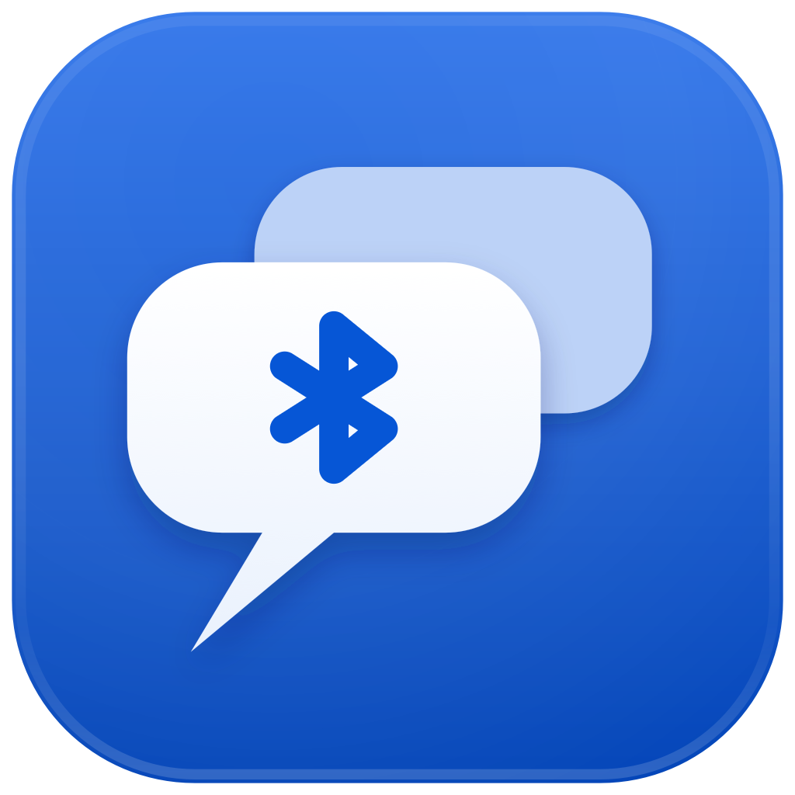
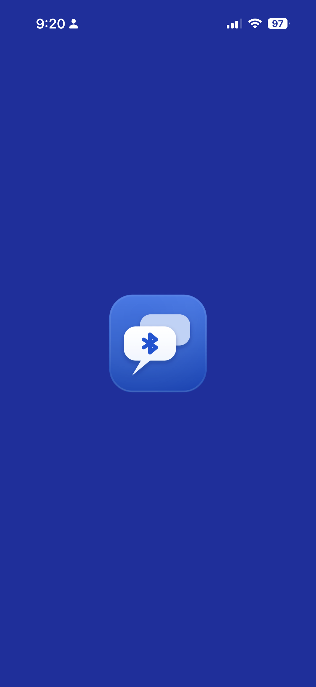
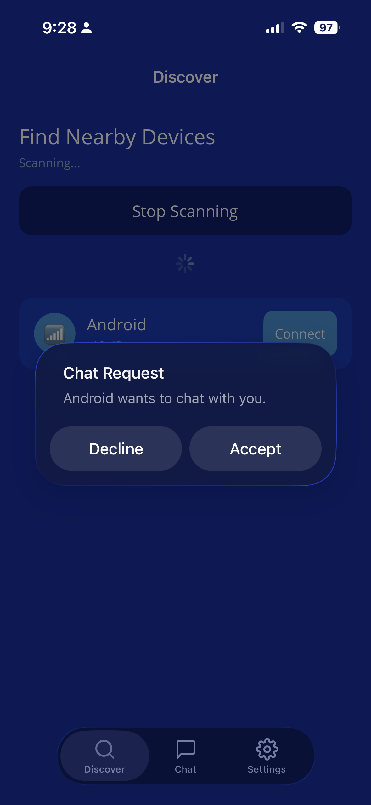
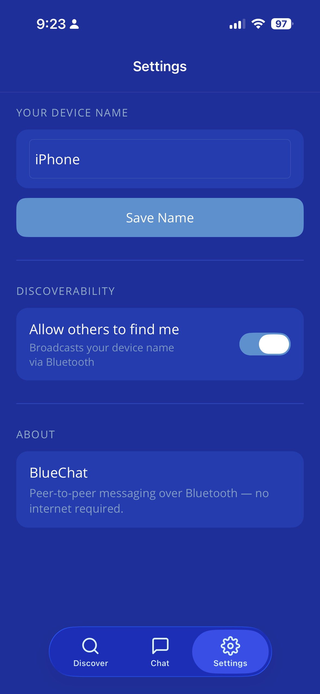
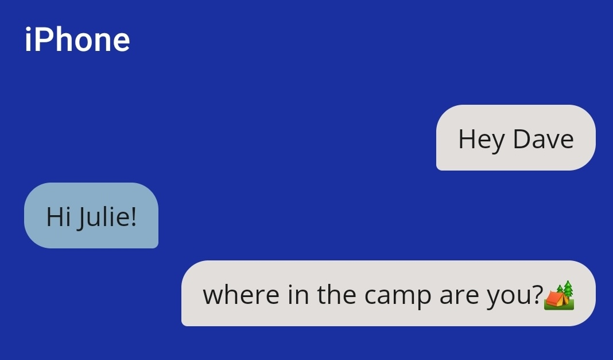
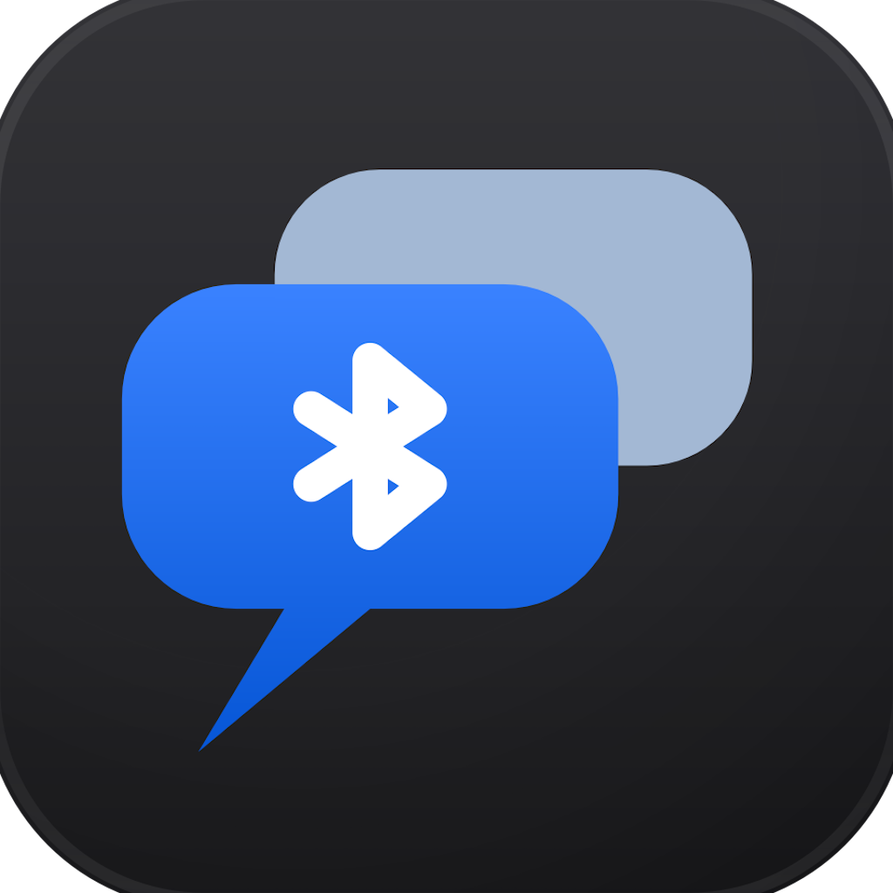
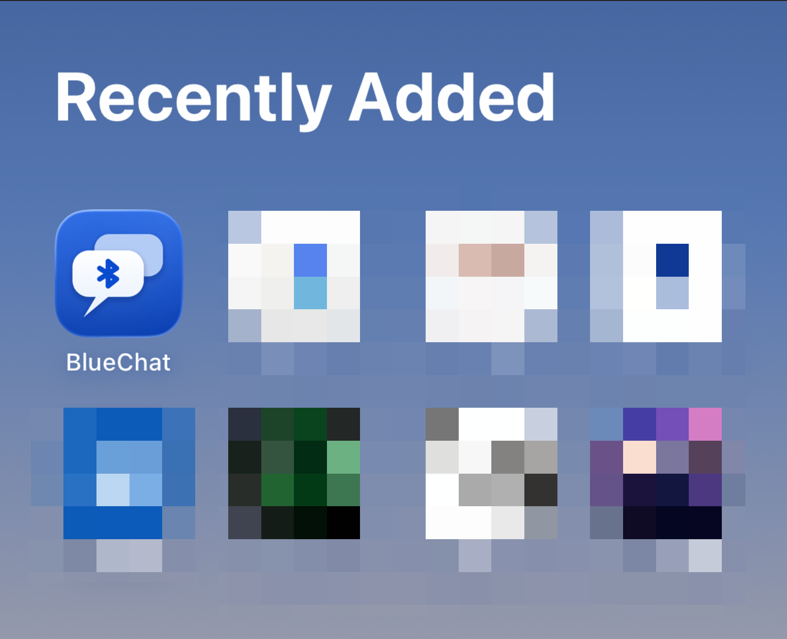

<h1><br>
BlueChat  </h1>

**Peer-to-peer messaging over Bluetooth — no internet required.**

BlueChat lets two nearby devices chat directly using Bluetooth Low Energy (BLE). No Wi-Fi, no cell signal, no server. Just open the app and start talking.

---

## Why BlueChat?

Most messaging apps assume you have an internet connection. BlueChat doesn't. It's built for situations where connectivity is limited or unavailable:

- **Off-grid communication** — coordinate with friends across a campground, on a hiking trail, or at a festival without burning cell data
- **Accessibility** — integrated **speech-to-text** and **text-to-speech** make BlueChat usable for people who have difficulty typing or reading, putting communication within reach regardless of ability
- **Privacy** — messages never leave the local Bluetooth connection; there's no account, no cloud, no logs

---

## Screenshots

<table>
  <tr>
    <td align="center"><b>Splash Screen</b><br></td>
    <td align="center"><b>Chat Request</b><br></td>
    <td align="center"><b>Settings</b><br></td>
  </tr>
</table>

---

## Features

| Feature | Description |
|---|---|
| **BLE Discovery** | Scan for nearby BlueChat devices and see signal strength (dBm) in real time |
| **Chat Requests** | Incoming connections prompt an Accept / Decline dialog — you control who you talk to |
| **Speech-to-Text** | Tap the microphone in the chat input to dictate your message |
| **Text-to-Speech** | Tap the speaker icon to have incoming messages read aloud |
| **Device Name** | Set a custom display name so nearby users know who they're connecting to |
| **Discoverability Toggle** | Switch off broadcasting at any time to go invisible to scanners |
| **Dark Mode Icon** | Adaptive app icon — light blue on iOS standard mode, dark variant for iOS dark mode |

<p align="center">
  
  <br/><i>Chat input bar — speaker (text-to-speech) on the left, microphone (speech-to-text) on the right</i>
</p>

---

## App Icons

BlueChat ships with two icon variants that iOS selects automatically based on the system appearance — a vibrant blue for the default mode and a dark-background variant for dark mode.

<table>
  <tr>
    <td align="center"><b>Default Icon</b><br></td>
    <td align="center"><b>Dark Mode Icon</b><br></td>
  </tr>
  <tr>
    <td align="center"><b>iOS Home Screen — Default</b><br></td>
    <td align="center"><b>iOS Home Screen — Dark Mode</b><br></td>
  </tr>
</table>

---

## How It Works

1. **Advertise** — when discoverability is on, the app broadcasts your device name over BLE so others can find you
2. **Scan** — tap *Scan for Devices* on the Discover tab to see nearby BlueChat users
3. **Connect** — tap *Connect* next to a device; the other person gets a chat request popup
4. **Chat** — once accepted, both sides can send and receive messages in real time over the BLE link; type or use the mic

> Bluetooth range is typically 10–30 m indoors and up to ~100 m line-of-sight outdoors, making it ideal for campground-scale coordination.

---

## Built With

| Tool | Role |
|---|---|
| [.NET MAUI](https://learn.microsoft.com/en-us/dotnet/maui/) | Single C# codebase deployed to both iOS and Android |
| [Plugin.BLE](https://github.com/dotnet-bluetooth-le/dotnet-bluetooth-le) | Cross-platform Bluetooth Low Energy API |
| Visual Studio Code | Primary IDE |
| [Claude Code](https://claude.ai/code) | AI pair-programmer used throughout development — a hands-on learning project for agentic coding workflows |

---

## Project Structure

```
BlueChat/
├── Models/            # Data models (device, message)
├── Services/
│   ├── BleService.cs          # BLE scanning, advertising, GATT
│   ├── IBlePeripheralService.cs
│   ├── SttService.cs          # Speech-to-text
│   └── TtsService.cs          # Text-to-speech
├── ViewModels/        # MVVM view models
├── Views/
│   ├── DiscoverPage.xaml      # Find nearby devices
│   ├── ChatPage.xaml          # Messaging UI
│   └── SettingsPage.xaml      # Device name & discoverability
├── Platforms/
│   ├── Android/       # Android-specific BLE peripheral service
│   └── iOS/           # iOS-specific BLE peripheral service
└── Resources/
    ├── AppIcon/       # Adaptive icons (light + dark)
    └── Splash/        # Splash screen assets
```

---

## Getting Started

### Prerequisites

- [.NET 8 SDK](https://dotnet.microsoft.com/download)
- MAUI workload: `dotnet workload install maui`
- Xcode (for iOS builds) or Android SDK (for Android builds)

### Run

```bash
# iOS simulator
dotnet build -f net8.0-ios -t:Run

# Android emulator
dotnet build -f net8.0-android -t:Run
```

### Permissions

The app requires Bluetooth permission on both platforms. On Android 12+, `BLUETOOTH_SCAN`, `BLUETOOTH_CONNECT`, and `BLUETOOTH_ADVERTISE` are requested at runtime. On iOS, the `NSBluetoothAlwaysUsageDescription` key is set in `Info.plist`.

---

## License

MIT
